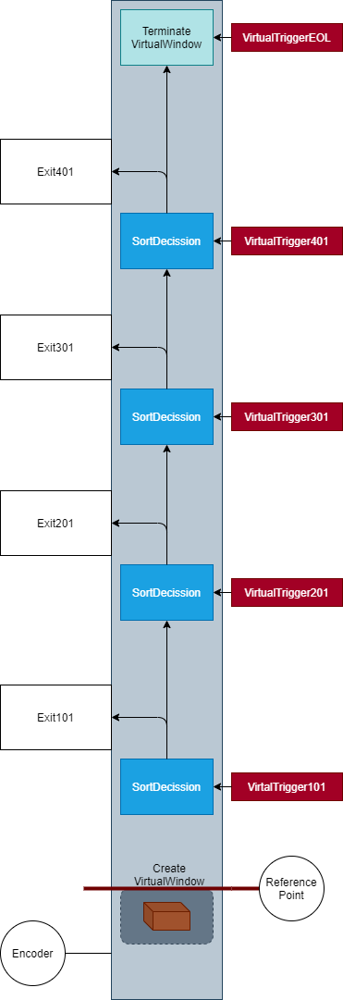

# Sorting Line Application Example

## Description

Sorting line by using the library `WindowTracking`

### Layout

This example shows a small example of a sorting line with 4 exits.



### How does it work

In this example every second, a `TransportWindow` will be created and one of 16 items in a list will be assigned to this window. Each item has one sort destination (exit point).

During the execution, a encoder will be simulated. This encoder will be incremented by 10mm every 10ms (corresponds 1m/s belt speed). In your application, the simulated encoder has to be replaced by a concrete one of type `IEncoder`.

The `TransportWindow` will be moved according the encoder values. When a `TransportWindow` reaches a `VirtualTrigger`, it will be activated and the event handler which belongs to the `VirtualTrigger`, will be executed.

1. If the event handler is a `SortDecisionEvent`:

    The `SortDecisionEvent` check, if the assigned item in the `TransportWindow` is designated for the active `TriggerPoint`.

    If yes, the exit handler of the `SortDecisionEvent` will be executed. In your application, you've to implement your own exit handler (e.g. if the exit is another conveyor, it has to be startup).

    If not, nothing happened.

1. If the event handler is a `TerminateWindowEvent`:

    In this case, the TransportWindow will be terminated. That has to be done at the end of the sorting line.

## Execute the Application Example (AX Code local)

> to use this application example you need to login into the GitHub registry. You'll find more information [here](https://github.com/simatic-ax/.github/blob/main/docs/personalaccesstoken.md)

1. Open a CLI and switch to the target folder like:

      ```cli
      D:
      cd \temp
      ```

1. Install the application example on your local PC

      Run the following commands in a CLI

      ```sh
      apax create @simatic-ax/ae-sortingline --registry https://npm.pkg.github.com ae-sortingline 
      ```

      ```sh
      cd ae-sortingline 
      ```

      install the dependencies with:

      ```sh
      apax install
      ```

      and open AxCode

      ```sh
      axcode . 
      ```

1. If it is not open, open a terminal in `AX Code` (`CTRL+SHIFT+ö`)

1. Start a PLCSIM Advanced Instance (IP: Address 192.168.0.1). To change the IP you'll find information [here](#tips-and-tricks)

1. Update your dependencies (optionally)

   ```cli
   apax update -a
   ```

1. Build and download the program to a PLC

   ```cli
   apax dlplc
   ```

   The project will be compiled and downloaded to the PLCSIM Advanced instance

1. Open the monitoring file mon.mon

1. Go online

    

1. Watch the values

   

## Tips and tricks

### Change the IP address for the downloader

To change the target IP address, open the `apax.yml` and search the entry `IP_ADDRESS`, Enter the IP address for your target.

### Change the IP address for the online debugging and monitoring

To change the IP address for the debugging, open the file `./vscode/launch.json` and search the entry `ip`, Enter the IP address for your device.

## Contribution

Thanks for your interest in contributing. Anybody is free to report bugs, unclear documentation, and other problems regarding this repository in the Issues section or, even better, is free to propose any changes to this repository using pull requests.

### Markdownlint-cli

This workspace will be checked by the [markdownlint-cli](https://github.com/igorshubovych/markdownlint-cli) (there is also documented ho to install the tool) tool in the CI workflow automatically.  
To avoid, that the CI workflow fails because of the markdown linter, you can check all markdown files locally by running the markdownlint with:

```sh
markdownlint **/*.md --fix
```

## License and Legal information

Please read the [Legal information](LICENSE.md)
